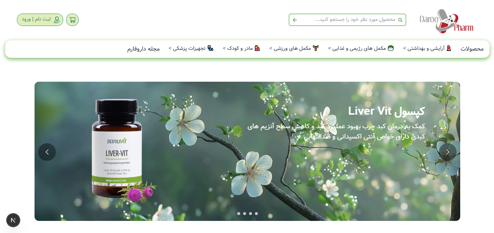
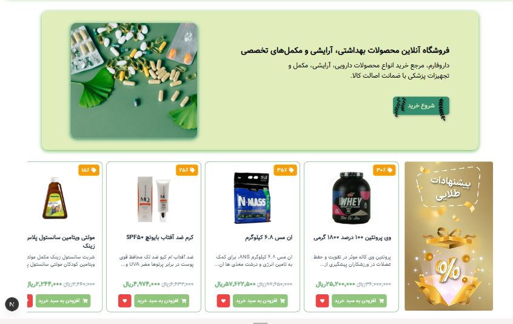
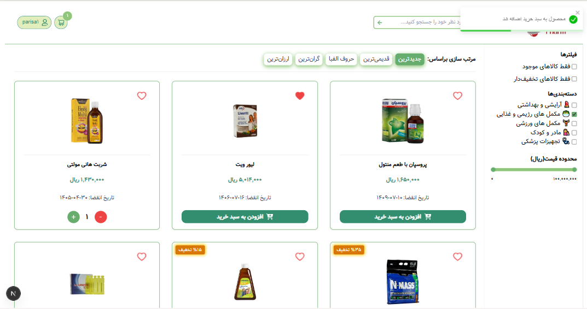
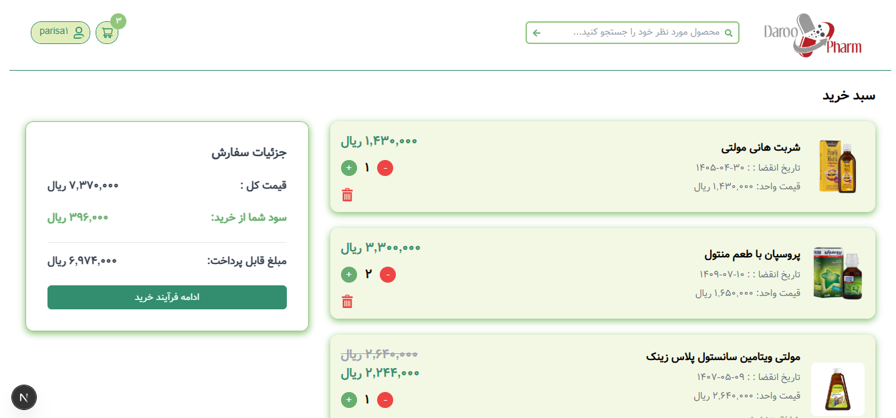
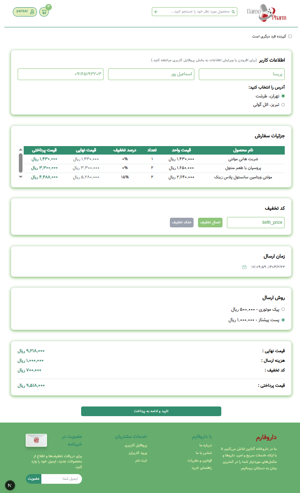
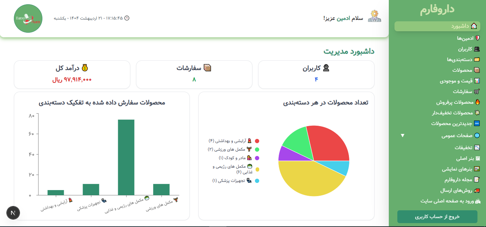
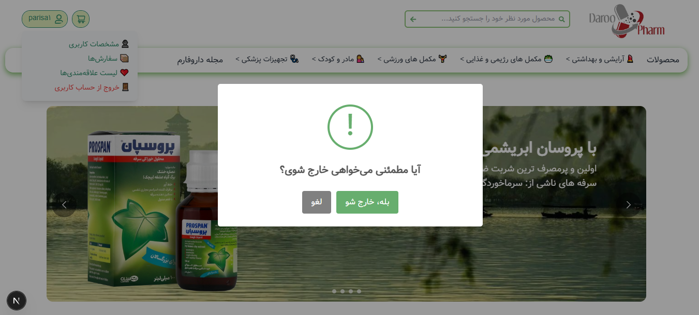
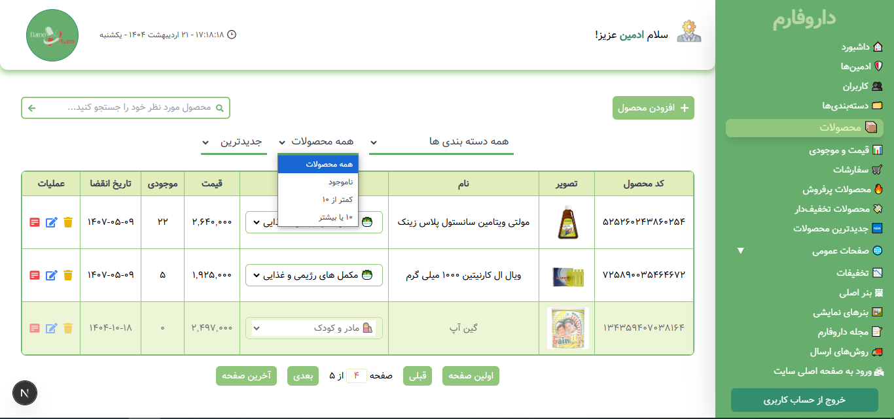

# داروخانه آنلاین داروفارم (Online Pharmacy)

A modern e-commerce platform for an online pharmacy built with Next.js, TypeScript, and Redux Toolkit.

## 🚀 Features

- **Product Management**

  - Add, edit, and delete products
  - Product categorization
  - Stock management
  - Image upload support
  - Product search and filtering

- **User Interface**

  - Responsive design with Tailwind CSS
  - RTL (Right-to-Left) support
  - Modern UI components
  - Loading states and animations
  - Toast notifications

- **Shopping Experience**

  - Shopping cart functionality
  - Product filtering and sorting
  - Pagination
  - Product details view
  - Image zoom functionality

- **Admin Features**
  - Product management dashboard
  - Category management
  - User management
  - Contact form management

## 🛠️ Tech Stack

- **Frontend Framework**: Next.js 15.2.4
- **Language**: TypeScript
- **State Management**: Redux Toolkit
- **Styling**: Tailwind CSS
- **UI Components**:
  - React Icons
  - React Toastify
- **Date Handling**:
  - Moment.js
  - Jalali Moment
  - React Datepicker
- **Rich Text Editing**:
  - TipTap
- **PDF Generation**: html2pdf.js
- **Charts**: Recharts
- **Form Handling**: React Hook Form
- **API Integration**: Axios

## ScreenShots

<div className="grid grid-cols-2 gap-8">
  







</div>

## 📦 Installation

1. Clone the repository:

```bash
git clone [https://github.com/Parisa-Esmaeilpour1993/maktab124-Final_Project-Esmaeilpour.git]
cd my-shop
```

2. Install dependencies:

```bash
npm install
# or
yarn install
# or
pnpm install
```

3. Create a `.env` file in the root directory and add your environment variables:

```env
API_KEY=your_api_key
```

4. Run the development server:

```bash
npm run dev
# or
yarn dev
# or
pnpm dev
```
